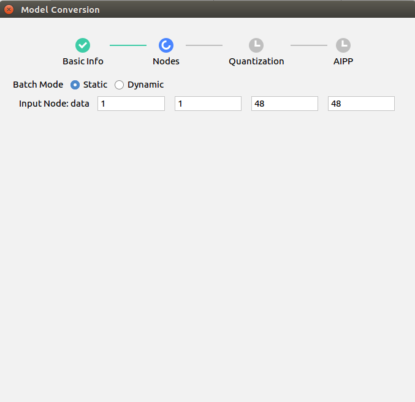
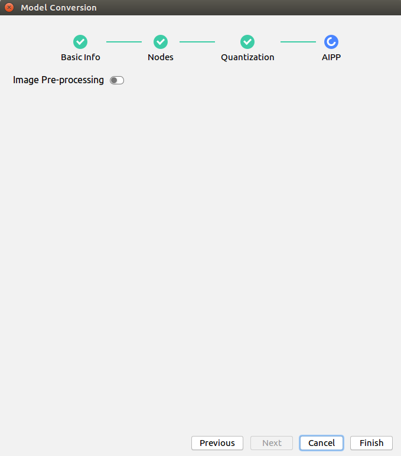

中文|[英文](README.md)

# 人脸表情识别<a name="ZH-CN_TOPIC_0185834698"></a>

开发者可以将本Application部署至Atlas 200 DK上实现摄像头对视频中的人脸表情预测，共有7种可能的表情，依次是生气（anger）、厌恶（digust）、恐惧（fear）、开心（happy）、伤心（sad）、惊讶（surprised）、中性（normal）。

## 前提条件<a name="zh-cn_topic_0182554631_section137245294533"></a>

部署此Sample前，需要准备好以下环境：

-   已完成Mind Studio的安装。
-   已完成Atlas 200 DK开发者板与Mind Studio的连接，交叉编译器的安装，SD卡的制作及基本信息的配置等。

## 软件准备<a name="zh-cn_topic_0182554631_section8534138124114"></a>

运行此Sample前，需要按照此章节获取源码包，并进行相关的环境配置。

1.  <a name="zh-cn_topic_0182554631_li953280133816"></a>获取源码包。

    将[https://gitee.com/Atlas200DK/sample-faceemotion](https://gitee.com/Atlas200DK/sample-faceemotion)仓中的代码以Mind Studio安装用户下载至Mind Studio所在Ubuntu服务器的任意目录，例如代码存放路径为：$HOME/sample-faceemotion。

2.  获取此应用中所需要的原始网络模型。

    参考[表1](#zh-cn_topic_0182554631_table97791025517)获取此应用中所用到的原始网络模型及其对应的权重文件，并将其存放到Mind Studio所在Ubuntu服务器的任意目录，例如：$HOME/ascend/models/faceemotion。

    **表 1**  Face Emotion中使用模型

    <a name="zh-cn_topic_0182554631_table97791025517"></a>
    <table><thead align="left"><tr id="zh-cn_topic_0182554631_row48791253115"><th class="cellrowborder" valign="top" width="13.309999999999999%" id="mcps1.2.4.1.1"><p id="zh-cn_topic_0182554631_p187902511114"><a name="zh-cn_topic_0182554631_p187902511114"></a><a name="zh-cn_topic_0182554631_p187902511114"></a>模型名称</p>
    </th>
    <th class="cellrowborder" valign="top" width="12.04%" id="mcps1.2.4.1.2"><p id="zh-cn_topic_0182554631_p148791259118"><a name="zh-cn_topic_0182554631_p148791259118"></a><a name="zh-cn_topic_0182554631_p148791259118"></a>模型说明</p>
    </th>
    <th class="cellrowborder" valign="top" width="74.65%" id="mcps1.2.4.1.3"><p id="zh-cn_topic_0182554631_p987922511111"><a name="zh-cn_topic_0182554631_p987922511111"></a><a name="zh-cn_topic_0182554631_p987922511111"></a>模型下载路径</p>
    </th>
    </tr>
    </thead>
    <tbody><tr id="zh-cn_topic_0182554631_row38791825912"><td class="cellrowborder" valign="top" width="13.309999999999999%" headers="mcps1.2.4.1.1 "><p id="zh-cn_topic_0182554631_p0879152519115"><a name="zh-cn_topic_0182554631_p0879152519115"></a><a name="zh-cn_topic_0182554631_p0879152519115"></a>face_detection</p>
    </td>
    <td class="cellrowborder" valign="top" width="12.04%" headers="mcps1.2.4.1.2 "><p id="zh-cn_topic_0182554631_p9879112516111"><a name="zh-cn_topic_0182554631_p9879112516111"></a><a name="zh-cn_topic_0182554631_p9879112516111"></a>人脸检测网络模型。</p>
    <p id="zh-cn_topic_0182554631_p1087912253112"><a name="zh-cn_topic_0182554631_p1087912253112"></a><a name="zh-cn_topic_0182554631_p1087912253112"></a>是基于Caffe的Resnet10-SSD300模型转换后的网络模型。</p>
    </td>
    <td class="cellrowborder" valign="top" width="74.65%" headers="mcps1.2.4.1.3 "><p id="zh-cn_topic_0182554631_p188801525813"><a name="zh-cn_topic_0182554631_p188801525813"></a><a name="zh-cn_topic_0182554631_p188801525813"></a>请参考<a href="https://gitee.com/HuaweiAscend/models/tree/master/computer_vision/object_detect/face_detection" target="_blank" rel="noopener noreferrer">https://gitee.com/HuaweiAscend/models/tree/master/computer_vision/object_detect/face_detection</a>目录中README.md下载原始网络模型文件及其对应的权重文件。</p>
    </td>
    </tr>
    <tr id="zh-cn_topic_0182554631_row11880162511114"><td class="cellrowborder" valign="top" width="13.309999999999999%" headers="mcps1.2.4.1.1 "><p id="zh-cn_topic_0182554631_p1388012251117"><a name="zh-cn_topic_0182554631_p1388012251117"></a><a name="zh-cn_topic_0182554631_p1388012251117"></a>face_emotion</p>
    </td>
    <td class="cellrowborder" valign="top" width="12.04%" headers="mcps1.2.4.1.2 "><p id="zh-cn_topic_0182554631_p1988018251110"><a name="zh-cn_topic_0182554631_p1988018251110"></a><a name="zh-cn_topic_0182554631_p1988018251110"></a>人脸表情分类模型。</p>
    <p id="zh-cn_topic_0182554631_p588013251514"><a name="zh-cn_topic_0182554631_p588013251514"></a><a name="zh-cn_topic_0182554631_p588013251514"></a>是基于Caffe的人脸表情模型转换后的网络模型。</p>
    </td>
    <td class="cellrowborder" valign="top" width="74.65%" headers="mcps1.2.4.1.3 "><p id="zh-cn_topic_0182554631_p28801025319"><a name="zh-cn_topic_0182554631_p28801025319"></a><a name="zh-cn_topic_0182554631_p28801025319"></a>请参考<a href="https://gitee.com/HuaweiAscend/models/tree/master/computer_vision/object_detect/face_emotion" target="_blank" rel="noopener noreferrer">https://gitee.com/HuaweiAscend/models/tree/master/computer_vision/object_detect/face_emotion</a><span>目录中</span>README.md下载原始网络模型文件及其对应的权重文件。</p>
    </td>
    </tr>
      
    </tbody>
    </table>

3.  将原始网络模型转换为适配昇腾AI处理器的模型，模型转换有Mind Studio工具转换和命令行转换两种方式。
    -   通过Mind Studio工具进行模型转换。
        1.  在Mind Studio操作界面的顶部菜单栏中选择**Tools \> Model Convert**，进入模型转换界面。
        2.  在弹出的**Model** **Conversion**操作界面中，进行模型转换配置，如[图 face\_detection模型转换配置](zh-cn_topic_0203223294.md#fig58411932131319)所示。

            **图 1**  face\_detection模型转换配置<a name="zh-cn_topic_0203223294_fig206931026131712"></a>  
            

            

            -   Model File选择[步骤2](#zh-cn_topic_0203223294_li1365682471610)中下载的模型文件，此时会自动匹配到权重文件并填写在Weight File中。
            -   Model Name填写为[表1](#zh-cn_topic_0203223294_table144841813177)中的模型名称：**face\_detection**。

        3.  单击**Next**，进入Nodes配置界面。

            **图 2**  Nodes配置示例<a name="zh-cn_topic_0203223294_fig3754173017185"></a>  
            

            

        4.  单击**Next**，进入Quantization配置界面。

            关闭**Quantization Configuration**按钮，不开启量化。

        5.  单击**Next**，进入AIPP配置界面。需要将**Input Image Size\[W\]\[H\]**分别修改为384,304， 此处需要做128\*16对齐。需要将**Model Image Format**修改为BGR888\_U8。其他使用默认值。如[图 AIPP配置](#zh-cn_topic_0203223294_fig1682055223010)所示

            **图 3**  AIPP配置<a name="zh-cn_topic_0203223294_fig1682055223010"></a>  
            

        6.  单击**Finish**，开始进行模型转换。

            转换时，会出现[图 模型转换错误](zh-cn_topic_0203223294.md#fig3694182619173)中所示的报错信息。

            **图 4**  模型转换错误<a name="zh-cn_topic_0203223294_fig2865313121718"></a>  
            

            

            此时在**DetectionOutput**层的**Suggestion**中选择**SSDDetectionOutput**，并点击**Retry**。

            模型转换成功后，后缀为.om的离线模型存放地址为：$HOME/modelzoo/face\_detection/device。

            > **说明：**   
            >Mindstudio模型转换中每一步的具体意义和参数说明可以参考[https://ascend.huawei.com/doc/mindstudio/2.1.0\(beta\)/zh/zh-cn\_topic\_0188462651.html](https://ascend.huawei.com/doc/mindstudio/2.1.0(beta)/zh/zh-cn_topic_0188462651.html)  


            此时在**DetectionOutput**层的**Suggestion**中选择**SSDDetectionOutput**，并点击**Retry**。

            模型转换成功后，后缀为.om的离线模型存放地址为_$HOME/modelzoo/face\_detection/device_。
        7.  FaceEmotion的模型转换和人脸检测模型转换类似，具体AIPP配置如下。

            转换时，请将AIPP配置关闭。

            **图 5**  FaceEmotion 输入参数配置<a name="zh-cn_topic_0203223294_fig2865313121718"></a>  

            

            **图 6**  FaceEmotion AIPP配置<a name="zh-cn_topic_0203223294_fig2865313121718"></a>  

            

            > **说明：**   
            >Mindstudio模型转换中每一步的具体意义和参数说明可以参考[https://ascend.huawei.com/doc/mindstudio/2.1.0\(beta\)/zh/zh-cn\_topic\_0188462651.html](https://ascend.huawei.com/doc/mindstudio/2.1.0(beta)/zh/zh-cn_topic_0188462651.html)  
    -   命令行模式转换模型
        1.  以Mind Studio安装用户进入存放原始模型的文件夹。

            **cd $HOME/models/facedetection**

        2.  使用omg工具执行以下命令进行模型转换。

            ```
            ${DDK_HOME}/uihost/bin/omg --output="./face_detection" --model="./face_detection.prototxt" --framework=0 --ddk_version=${tools_version} --weight="./face_detection.caffemodel" --input_shape=`head -1 $HOME/AscendProjects/sample-facedetection/script/shape_face_detection` --insert_op_conf=$HOME/AscendProjects/sample-facedetection/script/aipp_face_detection.cfg --op_name_map=$HOME/AscendProjects/sample-facedetection/script/reassign_operators
            ```

            > **说明：**   
            >-   input\_shape、insert\_op\_conf、op\_name\_map所需要的文件都在源码所在路径下的“sample-facedetection/script”目录下，请根据您实际的源码所在路径配置这些文件路径。  
            >-   每个参数的具体意义可以在以下文档中了解[https://ascend.huawei.com/doc/Atlas200DK/1.3.0.0/zh/zh-cn\_topic\_0165968579.html](https://ascend.huawei.com/doc/Atlas200DK/1.3.0.0/zh/zh-cn_topic_0165968579.html)。  


5.  将转换好的模型文件（.om文件）上传到[步骤1](#zh-cn_topic_0203223294_li953280133816)中源码所在路径下的“**sample-facedetection/script**”目录下。

4.  将转换好的模型文件（.om文件）上传到[1](#zh-cn_topic_0182554631_li953280133816)中源码所在路径的“sample-faceemotion/script”目录下。
5.  以Mind Studio安装用户登录Mind Studio所在Ubuntu服务器，并设置环境变量DDK\_HOME。

    **vim \~/.bashrc**

    执行如下命令在最后一行添加DDK\_HOME及LD\_LIBRARY\_PATH的环境变量。

    **export DDK\_HOME=$HOME/tools/che/ddk/ddk**

    **export LD\_LIBRARY\_PATH=$DDK\_HOME/uihost/lib**

    > **说明：**     
    >-   如果此环境变量已经添加，则此步骤可跳过。  

    输入:wq!保存退出。

    执行如下命令使环境变量生效。

    **source \~/.bashrc**


## 部署<a name="zh-cn_topic_0182554631_section147911829155918"></a>

1.  以Mind Studio安装用户进入faceemotion应用代码所在根目录，如：$HOME/sample-faceemotion。
2.  <a name="zh-cn_topic_0182554631_li08019112542"></a>执行部署脚本，进行工程环境准备，包括ascenddk公共库的编译与部署、Presenter Server服务器的配置等操作，其中Presenter Server用于接收Application发送过来的数据并通过浏览器进行结果展示。

    **bash deploy.sh** _host\_ip_ _model\_mode_

    -   _host\_ip_：Atlas 200 DK开发者板的IP地址。

    -   model\_mode代表模型文件及依赖软件的部署方式，默认为internet。
        -   local：若Mind Studio所在Ubuntu系统未连接网络，请使用local模式，执行此命令前，需要参考[公共代码库下载](#zh-cn_topic_0182554631_section158977311307)将依赖的代码库下载到“/sample-faceemotion/script“目录下。
        -   internet：若Mind Studio所在Ubuntu系统已连接网络，请使用internet模式，在线下载依赖代码库。


    命令示例：

    **bash deploy.sh 192.168.1.2 internet**

    -   当提示“Please choose one to show the presenter in browser\(default: 127.0.0.1\):“时，请输入在浏览器中访问Presenter Server服务所使用的IP地址（一般为访问Mind Studio的IP地址）。
    

    如[图4](#zh-cn_topic_0182554631_fig184321447181017)所示，请在“Current environment valid ip list“中选择通过浏览器访问Presenter Server服务使用的IP地址，并输入存储人脸识别解析数据的路径。

    **图 7**  工程部署示意图<a name="zh-cn_topic_0182554631_fig184321447181017"></a>  
   

3.  启动Presenter Server。

    执行如下命令在后台启动Facial Recognition应用的Presenter Server主程序。

    **bash start_prensenterserver.sh**

    
    如[图5](#zh-cn_topic_0182554631_fig69531305324)所示，表示presenter\_server的服务启动成功。

    **图 8**  Presenter Server进程启动<a name="zh-cn_topic_0182554631_fig69531305324"></a>  
    

    使用上图提示的URL登录Presenter Server，仅支持Chrome浏览器。IP地址为[2](#zh-cn_topic_0182554631_li08019112542)中输入的IP地址，端口号默为7009，如下图所示，表示Presenter Server启动成功。

    **图 9**  主页显示<a name="zh-cn_topic_0182554631_fig64391558352"></a>  
    

    Presenter Server、Mind Studio与Atlas 200 DK之间通信使用的IP地址示例如下图所示：

    **图 10**  IP地址示例<a name="zh-cn_topic_0182554631_fig1881532172010"></a>  
    

    其中：

    -   Atlas 200 DK开发者板使用的IP地址为192.168.1.2（USB方式连接）。
    -   Presenter Server与Atlas 200 DK通信的IP地址为UI Host服务器中与Atlas 200 DK在同一网段的IP地址，例如：192.168.1.223。
    -   通过浏览器访问Presenter Server的IP地址本示例为：10.10.0.1，由于Presenter Server与Mind Studio部署在同一服务器，此IP地址也为通过浏览器访问Mind Studio的IP。


## 运行<a name="zh-cn_topic_0182554631_section1676879104"></a>

1.  运行Face Emotion程序。

    在“sample-faceemotion“目录下执行如下命令运行Facial Recognition应用程序。

    **bash run\_faceemotionapp.sh** _host\_ip_ _presenter\_view\_app\_name  camera\_channel\_name_   &

    -   _host\_ip_：对于Atlas 200 DK开发者板，即为开发者板的IP地址。
    -   _presenter\_view\_app\_name_：用户自定义的在Presenter Server界面展示的App Name，此Name需要在Presenter Server展示界面唯一，只能是大小写字母、数字、“_”的组合，位数3-20。
    -   _camera\_channel\_name_：摄像头所属Channel，取值为“Channel-1“或者“Channel-2“，查询摄像头所属Channel的方法请参考[Atlas 200 DK使用指南](https://ascend.huawei.com/documentation)中的“如何查看摄像头所属Channel”。

    命令示例：

    **bash run\_faceemotionapp.sh 192.168.1.2 video Channel-1 &**

2.  使用启动Presenter Server服务时提示的URL登录 Presenter Server 网站，仅支持Chrome浏览器。

    Presenter Server展示界面如[图8](#zh-cn_topic_0182554631_fig1189774382115)所示。

    **图 11**  Presenter Server界面<a name="zh-cn_topic_0182554631_fig1189774382115"></a>  
    

    > **说明：**   
    >-   Face Emotion的Presenter Server最多支持2路Channel同时显示，每个  _presenter\_view\_app\_name_  对应一路Channel。  
    >-   由于硬件的限制，每一路支持的最大帧率是20fps，受限于网络带宽的影响，帧率会自动适配较低的帧率进行显示。  


## 后续处理<a name="zh-cn_topic_0182554631_section1092612277429"></a>

-   **停止人脸表情应用**

    Face Emotion应用执行后会处于持续运行状态，若要停止Face Emotion应用程序，可执行如下操作。

    以Mind Studio安装用户在“sample-faceemotion“目录下执行如下命令：

    **bash stop\_faceemotionapp.sh** _host\_ip_

    _host\_ip_：对于Atlas 200 DK开发者板，即为开发者板的IP地址。。

    命令示例：

    **bash stop\_faceemotionapp.sh 192.168.1.2**

-   **停止Presenter Server服务**

    Presenter Server服务启动后会一直处于运行状态，若想停止人脸识别应用对应的Presenter Server服务，可执行如下操作。

    **bash stop_prensenterserver.sh**

## 公共代码库下载<a name="zh-cn_topic_0182554631_section158977311307"></a>

将依赖的软件库下载到“/sample-faceemotion/script“目录下。

**表 2**  依赖代码库下载

<a name="zh-cn_topic_0182554631_table1271020412443"></a>
<table><thead align="left"><tr id="zh-cn_topic_0182554631_row13710144154411"><th class="cellrowborder" valign="top" width="33.33333333333333%" id="mcps1.2.4.1.1"><p id="zh-cn_topic_0182554631_p1371014419447"><a name="zh-cn_topic_0182554631_p1371014419447"></a><a name="zh-cn_topic_0182554631_p1371014419447"></a>模块名称</p>
</th>
<th class="cellrowborder" valign="top" width="33.33333333333333%" id="mcps1.2.4.1.2"><p id="zh-cn_topic_0182554631_p207101347444"><a name="zh-cn_topic_0182554631_p207101347444"></a><a name="zh-cn_topic_0182554631_p207101347444"></a>模块描述</p>
</th>
<th class="cellrowborder" valign="top" width="33.33333333333333%" id="mcps1.2.4.1.3"><p id="zh-cn_topic_0182554631_p871019424412"><a name="zh-cn_topic_0182554631_p871019424412"></a><a name="zh-cn_topic_0182554631_p871019424412"></a>下载地址</p>
</th>
</tr>
</thead>
<tbody><tr id="zh-cn_topic_0182554631_row971014444418"><td class="cellrowborder" valign="top" width="33.33333333333333%" headers="mcps1.2.4.1.1 "><p id="zh-cn_topic_0182554631_p11710548449"><a name="zh-cn_topic_0182554631_p11710548449"></a><a name="zh-cn_topic_0182554631_p11710548449"></a>EZDVPP</p>
</td>
<td class="cellrowborder" valign="top" width="33.33333333333333%" headers="mcps1.2.4.1.2 "><p id="zh-cn_topic_0182554631_p1771117413440"><a name="zh-cn_topic_0182554631_p1771117413440"></a><a name="zh-cn_topic_0182554631_p1771117413440"></a>对DVPP接口进行了封装，提供对图片/视频的处理能力。</p>
</td>
<td class="cellrowborder" valign="top" width="33.33333333333333%" headers="mcps1.2.4.1.3 "><p id="zh-cn_topic_0182554631_p17112404416"><a name="zh-cn_topic_0182554631_p17112404416"></a><a name="zh-cn_topic_0182554631_p17112404416"></a><a href="https://gitee.com/Atlas200DK/sdk-ezdvpp" target="_blank" rel="noopener noreferrer">https://gitee.com/Atlas200DK/sdk-ezdvpp</a></p>
<p id="zh-cn_topic_0182554631_p8711344441"><a name="zh-cn_topic_0182554631_p8711344441"></a><a name="zh-cn_topic_0182554631_p8711344441"></a>下载后请保持文件夹名称为ezdvpp。</p>
</td>
</tr>
<tr id="zh-cn_topic_0182554631_row5711846445"><td class="cellrowborder" valign="top" width="33.33333333333333%" headers="mcps1.2.4.1.1 "><p id="zh-cn_topic_0182554631_p1171111418446"><a name="zh-cn_topic_0182554631_p1171111418446"></a><a name="zh-cn_topic_0182554631_p1171111418446"></a>Presenter Agent</p>
</td>
<td class="cellrowborder" valign="top" width="33.33333333333333%" headers="mcps1.2.4.1.2 "><p id="zh-cn_topic_0182554631_p4711441449"><a name="zh-cn_topic_0182554631_p4711441449"></a><a name="zh-cn_topic_0182554631_p4711441449"></a>与Presenter Server进行交互的API接口。</p>
</td>
<td class="cellrowborder" valign="top" width="33.33333333333333%" headers="mcps1.2.4.1.3 "><p id="zh-cn_topic_0182554631_p15711144204416"><a name="zh-cn_topic_0182554631_p15711144204416"></a><a name="zh-cn_topic_0182554631_p15711144204416"></a><a href="https://gitee.com/Atlas200DK/sdk-presenter/tree/master" target="_blank" rel="noopener noreferrer">https://gitee.com/Atlas200DK/sdk-presenter/tree/master</a></p>
<p id="zh-cn_topic_0182554631_p11711548443"><a name="zh-cn_topic_0182554631_p11711548443"></a><a name="zh-cn_topic_0182554631_p11711548443"></a>请获取此路径下的presenteragent文件夹，下载后请保持文件夹名称为presenteragent。</p>
</td>
</tr>
<tr id="zh-cn_topic_0182554631_row771184174413"><td class="cellrowborder" valign="top" width="33.33333333333333%" headers="mcps1.2.4.1.1 "><p id="zh-cn_topic_0182554631_p27112434415"><a name="zh-cn_topic_0182554631_p27112434415"></a><a name="zh-cn_topic_0182554631_p27112434415"></a>tornado (5.1.0)</p>
<p id="zh-cn_topic_0182554631_p17113484416"><a name="zh-cn_topic_0182554631_p17113484416"></a><a name="zh-cn_topic_0182554631_p17113484416"></a>protobuf (3.5.1)</p>
<p id="zh-cn_topic_0182554631_p15711848444"><a name="zh-cn_topic_0182554631_p15711848444"></a><a name="zh-cn_topic_0182554631_p15711848444"></a>numpy (1.14.2)</p>
</td>
<td class="cellrowborder" valign="top" width="33.33333333333333%" headers="mcps1.2.4.1.2 "><p id="zh-cn_topic_0182554631_p1771117415442"><a name="zh-cn_topic_0182554631_p1771117415442"></a><a name="zh-cn_topic_0182554631_p1771117415442"></a>Presenter Server依赖的Python库</p>
</td>
<td class="cellrowborder" valign="top" width="33.33333333333333%" headers="mcps1.2.4.1.3 "><p id="zh-cn_topic_0182554631_p9711542447"><a name="zh-cn_topic_0182554631_p9711542447"></a><a name="zh-cn_topic_0182554631_p9711542447"></a>可以在python官网<a href="https://pypi.org/" target="_blank" rel="noopener noreferrer">https://pypi.org/</a>上搜索相关包进行安装。</p>
<p id="zh-cn_topic_0182554631_p117111742441"><a name="zh-cn_topic_0182554631_p117111742441"></a><a name="zh-cn_topic_0182554631_p117111742441"></a>若使用pip3 install命令在线下载，可以使用如下命令指定相关版本进行下载，例如：</p>
<p id="zh-cn_topic_0182554631_p11712249444"><a name="zh-cn_topic_0182554631_p11712249444"></a><a name="zh-cn_topic_0182554631_p11712249444"></a>pip3 install tornado==5.1.0  -i  <em id="zh-cn_topic_0182554631_i471224104410"><a name="zh-cn_topic_0182554631_i471224104410"></a><a name="zh-cn_topic_0182554631_i471224104410"></a>指定库的安装源</em>  --trusted-host  <em id="zh-cn_topic_0182554631_i14712449449"><a name="zh-cn_topic_0182554631_i14712449449"></a><a name="zh-cn_topic_0182554631_i14712449449"></a>安装源的主机名</em></p>
</td>
</tr>
</tbody>
</table>

